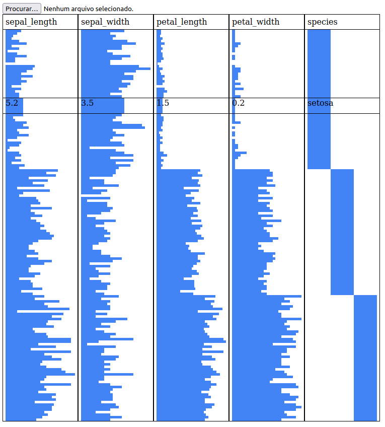
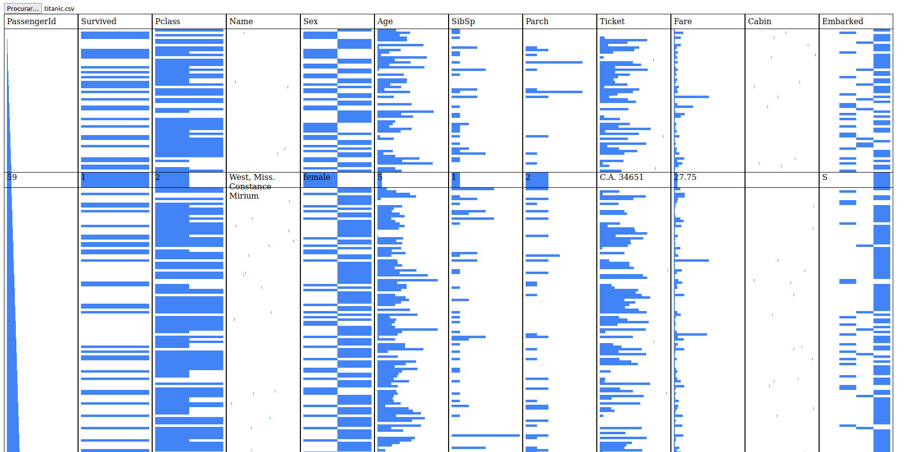

# Table Lens
Implementação da técnica de visualização de informação **Table Lens** utilizando as biblitecas [d3](https://d3js.org/) e [react](https://pt-br.reactjs.org/). O aplicativo se encontra no seguinte [link](https://tablelens.herokuapp.com/).

## Instalação local
A seguir, são listados os passos para rodar o aplicativo localmente:
- Instalar o [nodejs](https://nodejs.org/) e o [npm](https://www.npmjs.com/) na máquina
- Clonar o repositório
- Entrar na pasta do repositório
- Instalar as dependências com o comando `npm i`
- Inicializar o servidor com o comando `npm start`
- O browser será aberto com a aplicação rodando

## Exemplos de datasets
- Conjunto de dados [Iris](https://archive.ics.uci.edu/ml/datasets/iris)

- Conjunto de dados [TItanic](https://www.kaggle.com/c/titanic)
